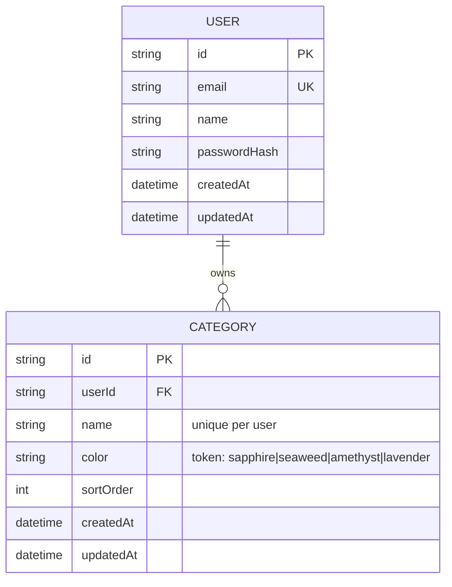

# billd — Entity Relationship Diagram

> Living document — updated in any story branch that changes models, so the diagram diff rides in the same PR as the migration. Money is **integer cents** everywhere (`amountCents Int`).

## Conventions
- All money columns are `Int` named `*Cents`.
- Every entity is user-scoped (`userId` FK); deletes cascade from `User`.
- `Category` is created in S1.2 (seeded at signup); CRUD/UI is S3.1.
