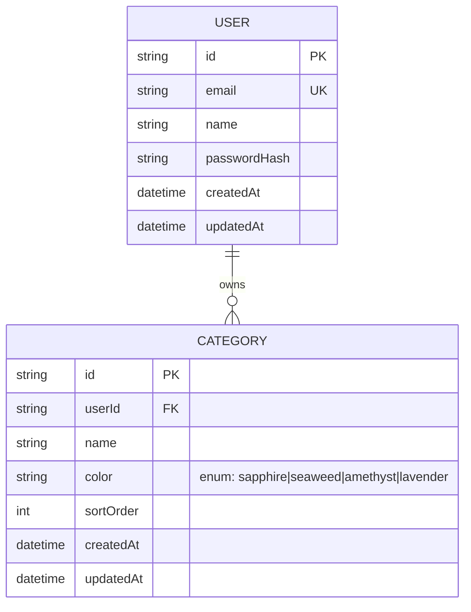
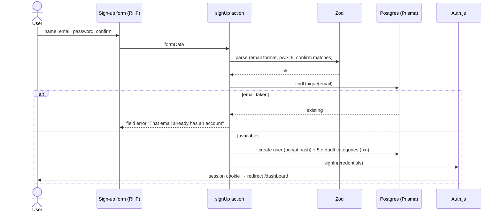

# S1.2 — Sign up, log in, log out

> Story: [Notion S1.2](https://app.notion.com/p/37ca7227e26f81aa95f7ee1960ff6f22) · Design: [F1 Accounts](https://app.notion.com/p/37ca7227e26f81c78790f25db76505e7) · Design system: [canonical](https://app.notion.com/p/37da7227e26f81f28e85fa5c6d1d38f8) · PR: #2 (stacked on #1)

## Objective

Credentials auth per Design F1: Auth.js v5 signup (with default-category seeding) and login (generic errors), JWT sessions, middleware route protection, and user-scoped data access — the foundation every later story's ownership checks depend on.

## Data Model

Introduces **User** and **Category**. (Category arrives here, one story earlier than the original ERD note, because AC-2 seeds default categories at signup — the seed needs the model. Expense still lands in S2.1.) Color is a palette **token name** (enum), never a hex, per Design F3.

`Category` gets a unique index on `(userId, lower(name))` for the case-insensitive per-user uniqueness S3.1 will enforce; `@@unique([userId, name])` at the Prisma layer plus a citext-free lower() guard in the create action.

## Endpoints

Auth.js mounts its own handler; first-party flows are Server Actions, not routes.

| Method | Path | Purpose | Auth |
|--------|------|---------|------|
| GET/POST | `/api/auth/[...nextauth]` | Auth.js credentials handler (session, callbacks) | public |
| (server action) | `signUp` | validate → hash → create user → seed categories → sign in | public |
| (server action) | `logIn` | credentials sign-in, generic error | public |
| (server action) | `logOut` | destroy session → redirect `/login` | session |

## Sequence — sign up

## Approach

1. `npm i next-auth@beta bcryptjs zod` (+ `@types/bcryptjs`).
2. Prisma schema: User + Category models; `prisma migrate dev` against local `billd_dev`; commit the migration SQL.
3. `src/lib/auth.ts` — Auth.js v5 config: Credentials provider, JWT strategy, `session.user.id` callback, `/login` page. Export `auth`, `signIn`, `signOut`, handlers.
4. `src/lib/validation/auth.ts` — shared Zod schemas (signUp, logIn).
5. Server actions in `src/app/(auth)/actions.ts`: `signUp`, `logIn`, `logOut`. Seed list = Groceries·seaweed, Dining out·amethyst, Transit·sapphire, Hobbies·amethyst, Rent·sapphire (sortOrder 0–4), in a transaction with the user create.
6. Pages: `(auth)/login/page.tsx`, `(auth)/signup/page.tsx` — match the F1 frames (centered notched card, Silkscreen wordmark, pixel divider, Sapphire primary, Amethyst field errors). shadcn `input`/`button`/`label` + `form`.
7. `src/middleware.ts` — protect `(dashboard)` routes; redirect unauthenticated → `/login?callbackUrl=`; redirect authenticated away from `/login`+`/signup`. Placeholder `/dashboard` stub page (real one is S5.1) so the redirect target resolves.
8. `src/lib/session.ts` — `requireUser()` helper returning the session user id for ownership-scoped queries.

## Test Manifest

| ID | Test | Type | Covers |
|----|------|------|--------|
| T1 | signUp Zod: rejects bad email, pw<8, mismatch | unit | AC-1 |
| T2 | signUp action: creates user with bcrypt hash + 5 seeded categories (txn) | integration (local DB) | AC-1, AC-2 |
| T3 | duplicate email → field error, no second user created | integration | AC-6 |
| T4 | password is hashed, never stored plaintext | integration | AC-1 |
| T5 | logIn wrong creds → single generic error string | unit/integration | AC-3 |
| T6 | middleware: unauth → /login w/ callbackUrl; auth → returned to target | e2e (Playwright) | AC-4 |
| T7 | logout clears session → /login | e2e | AC-5 |
| T8 | already-authed visiting /login redirects to /dashboard | e2e | AC-4 |
| T9 | signup + login pages render F1 layout (wordmark, fields, Sapphire CTA) | unit (RTL) | design |

Integration tests run against `billd_dev` (local Postgres); CI spins a `postgres` service container and runs `prisma migrate deploy` before tests.

## Results

| ID | Pass/Fail | Evidence |
|----|-----------|----------|
| T1 signUp Zod (email/pw/confirm) | ✅ Pass | `src/lib/validation/auth.test.ts` |
| T2 signup creates user + bcrypt hash + 5 seeded categories | ✅ Pass | `actions.int.test.ts` (local DB) + live e2e seed query |
| T3 duplicate email → no second user | ✅ Pass | `actions.int.test.ts` unique-constraint test |
| T4 password hashed, never plaintext | ✅ Pass | bcrypt.compare assertion |
| T5 wrong creds → generic error | ✅ Pass | live e2e step 5: stays /login, "Email or password didn't match" |
| T6 middleware unauth→/login?callbackUrl; auth→target | ✅ Pass | live e2e step 1: `/budgets` → `/login?callbackUrl=%2Fbudgets` |
| T7 logout → /login | ✅ Pass | live e2e step 3 |
| T8 authed visiting /login → /dashboard | ✅ Pass | live e2e step 6 |
| T9 login/signup render F1 layout | ✅ Pass | `login/page.test.tsx` + screenshots |

**Live e2e (dev server + local Postgres), all 6 flows green:**
1. protected logged-out → `/login?callbackUrl=%2Fbudgets`
2. signup → `/dashboard`  3. logout → `/login`  4. relogin → `/dashboard`
5. wrong-pw → stays `/login`, generic error shown
6. authed visiting `/login` → `/dashboard`
Seeded categories verified in DB: Groceries/seaweed, Dining out/amethyst, Transit/sapphire, Hobbies/amethyst, Rent/sapphire (sortOrder 0–4).
22 unit/integration tests pass · lint clean · build green · typecheck clean.

## Deviations

- **Category model introduced in S1.2** (was ERD-noted for S2.1) — AC-2's default-category seeding requires it. S2.1 now only adds Expense; S3.1 still owns Category CRUD/UI.
- CI gains a Postgres service container + migrate step; the e2e job becomes blocking now that there are real flows (planned at S1.1).
