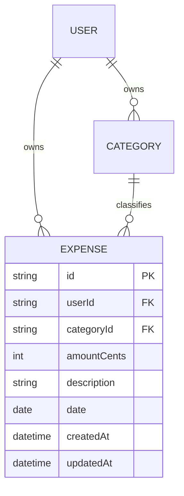

# S2.1 — Expense model & list page

> Story: [Notion S2.1](https://app.notion.com/p/37ca7227e26f81928470e2ad01557d5a) · Design: [F2 Expenses](https://app.notion.com/p/37ca7227e26f81a29b6bd8688d11cc1c) · Design system: [canonical](https://app.notion.com/p/37da7227e26f81f28e85fa5c6d1d38f8) · PR: #4 (base `main`)

## Objective

Add the Expense model (integer cents) and the server-rendered Expenses list page — table, pagination, empty states — plus the dashboard app shell (sidebar) this is the first story to require. No mutations (those are S2.2).

## Data Model

Adds **Expense**. Amount is `amountCents Int` (never a float/decimal), per the money convention.

`categoryId` is `onDelete: Restrict` (a category in use can't be deleted — enforces F3's delete guard at the DB). Indexes on `(userId, date)` for the default sort and `(categoryId)` for the F3 usage counts.

## Endpoints

None — the list is a React Server Component reading via Prisma. Mutations (Server Actions) are S2.2; search/filter params are S2.4. This story renders the default view (date desc, page 1, 25/page).

## Approach

1. Prisma: `Expense` model; `prisma migrate dev`; commit migration; update `docs/architecture/erd.md`.
2. `src/lib/money.ts` — `formatCents(cents): string` (CAD, two-decimal, the only money formatter) + `parseAmountToCents` stub (used in S2.2). Pure functions, unit-tested.
3. `src/components/Money.tsx` — renders `formatCents` with tabular numerals, right-aligned, tone variants (default/positive/attention/muted) per the generated `Money` contract.
4. `src/components/CategoryPill.tsx` — palette-token pill (square, 1px border, color swatch + name).
5. **App shell:** `src/app/(dashboard)/layout.tsx` + `src/components/Sidebar.tsx` — 240px sidebar (wordmark, nav: Dashboard/Expenses/Categories/Budgets/Recurring with active state, account footer + logout). Replaces the S1.2 dashboard stub's standalone layout; the stub page stays until S5.1.
6. `src/app/(dashboard)/expenses/page.tsx` — RSC: `requireUser()`, fetch page of expenses (date desc, take 25, skip by `?page`), render header (count + total via `formatCents`), table, pagination footer. Empty states: zero-expenses-ever → first-run panel with ⌘K hint; (filtered-empty is S2.4).
7. `src/components/ExpenseTable.tsx` — columns Date / Description / Category pill / Amount (right-aligned tabular).
8. `src/lib/pagination.ts` — `paginate(total, page, perPage=25)` → `{ skip, take, pageCount, label }`. Pure, unit-tested.
9. `prisma/seed.ts` — dev seed: a user + the 5 categories + ~23 sample expenses (the F2 sample data), all integer cents. `npm run seed`.

## Test Manifest

| ID | Test | Type | Covers |
|----|------|------|--------|
| T1 | `formatCents` renders 184257 → "$1,842.57"; 0 → "$0.00"; never floats | unit | AC-1, AC-2 |
| T2 | money math (sum of cents) stays integer; no float drift across a list | unit | AC-2 |
| T3 | `paginate` math: skip/take/pageCount + "Showing X of Y · page N of M" | unit | AC-3 |
| T4 | ExpenseTable renders date/description/pill/amount, amount right-aligned tabular | unit (RTL) | AC-1 |
| T5 | empty-state panel shows ⌘K hint when no expenses | unit (RTL) | AC-4 |
| T6 | Expense persists amountCents as Int; round-trips exact cents | integration (local DB) | AC-2, AC-5 |
| T7 | list page renders a seeded page of 25, ordered date desc | integration/e2e | AC-1, AC-3 |

## Results

| ID | Pass/Fail | Evidence |
|----|-----------|----------|

## Deviations

- App-shell sidebar layout added here (first story needing it); S5.1 builds the dashboard content within the same shell.
