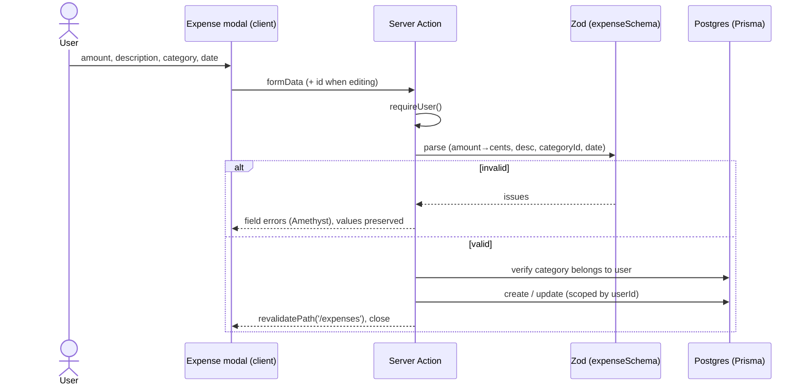

# S2.2 — Create, edit, delete expense

> Story: [Notion S2.2](https://app.notion.com/p/37ca7227e26f8107a84dd89deaaf8e85) · Design: [F2 Expenses](https://app.notion.com/p/37ca7227e26f81a29b6bd8688d11cc1c) · Design system: [canonical](https://app.notion.com/p/37da7227e26f81f28e85fa5c6d1d38f8) · PR: #5 (base `main`)

## Objective

Full mutation set for expenses — create, edit, delete — via a shared modal, with Server Actions + Zod validation per the Standards mutation flow. The ⌘K quick-add fast path is S2.3; this story makes the modal work from the Expenses page.

## Data Model

No schema change — Expense already exists (S2.1). Adds a shared Zod schema and Server Actions.

## Endpoints

First-party writes are Server Actions (no API routes), per Standards.

| Action | Purpose | Auth |
|--------|---------|------|
| `createExpense` | validate → insert (user-scoped) → revalidate | session |
| `updateExpense` | validate → ownership check → update → revalidate | session |
| `deleteExpense` | ownership check → delete → revalidate | session |

## Sequence — create / edit

## Approach

1. `src/lib/validation/expense.ts` — `expenseSchema` (Zod): `amount` string → cents via `parseAmountToCents` ($0.01–$999,999.99), `description` 1–120, `categoryId` non-empty, `date` ≤ today+1yr. Reused by S2.3/S2.4.
2. `src/app/(dashboard)/expenses/actions.ts` — `createExpense`, `updateExpense`, `deleteExpense`. Each `requireUser()`; mutations are **user-scoped in the where-clause** (update/delete use `where: { id, userId }` so one user can't touch another's row); category ownership verified before write; `revalidatePath('/expenses')` (and `/dashboard` for later).
3. `src/components/ExpenseModal.tsx` (client) — shared create/edit modal per F2 quick-add frame: amount (masked), description, category `<select>` (user's categories), date (default today). `useActionState`; field errors in Amethyst; **save-and-close** here (the save-and-clear rapid loop is S2.3). Title swaps "Add expense" / "Edit expense". Delete affordance (edit mode) with inline confirm — no browser dialogs.
4. Wire into the Expenses page: "Add expense" header button opens create modal; row click opens edit modal pre-filled. Categories fetched server-side, passed to the page's client island.
5. `src/components/ExpenseRowActions` / make table rows clickable → open edit. Keep the table a server component; lift the modal + open-state into a small client wrapper (`ExpensesClient`) that the page renders around the server-rendered table.

## Field rules (from Design F2)

| Field | Type | Limits | Validation | Default |
|-------|------|--------|------------|---------|
| Amount | money (cents) | $0.01–$999,999.99 | required, integer cents, >0, ≤2dp | empty |
| Description | text | 1–120, trimmed | required | empty |
| Category | FK | must belong to user | required, ownership | first category |
| Date | date | ≤ today+1yr | required, valid | today (America/Toronto) |

## Test Manifest

| ID | Test | Type | Covers |
|----|------|------|--------|
| T1 | `expenseSchema` accepts valid; rejects $0, >$999,999.99, >2dp, empty desc, missing category, far-future date | unit | AC-1 |
| T2 | createExpense inserts a user-scoped row with correct cents | integration (DB) | AC-1 |
| T3 | updateExpense edits values; cannot update another user's expense (where id+userId) | integration | AC-2 |
| T4 | deleteExpense removes own row; cannot delete another user's | integration | AC-3 |
| T5 | create rejects a categoryId not owned by the user | integration | AC-1 |
| T6 | modal renders create + edit (prefilled) states; errors show in Amethyst | unit (RTL) | AC-4 |
| T7 | live: add an expense from /expenses, it appears; edit it; delete it (inline confirm) | e2e (Playwright) | AC-1/2/3/5 |

## Scope addition (Josh, during review)

"Create another" checkbox on the create modal (JIRA pattern): when checked, a successful save keeps the modal open, resets the form to a clean slate, refocuses Amount, and flashes a Seaweed "Saved ✓" — for rapid multi-entry. Cancel becomes "Done". Edit mode is unaffected (shows Delete, not the checkbox). This delivers the rapid-entry behaviour the plan had earmarked for S2.3; S2.3 now focuses on the global ⌘K shortcut + most-recently-used category default + keyboard-first feel.

## Results

| ID | Pass/Fail | Evidence |
|----|-----------|----------|
| T1 expenseSchema valid/invalid | ✅ Pass | `expense.test.ts` — $0, >limit, >2dp, empty desc, missing cat, far date all rejected |
| T2 createExpense user-scoped + cents | ✅ Pass | `actions.int.test.ts` |
| T3 update can't touch another user's row | ✅ Pass | `actions.int.test.ts` (updateMany id+userId → count 0) |
| T4 delete can't remove another user's row | ✅ Pass | `actions.int.test.ts` |
| T5 foreign category rejected | ✅ Pass | `actions.int.test.ts` ownership check |
| T6 modal create + edit (prefilled), Amethyst errors | ✅ Pass | `ExpensesClient.test.tsx` + live screenshot |
| T7 live create → edit → delete → validation | ✅ Pass | e2e: create row appears; edit replaces (date prefilled correctly); delete via inline confirm removes; $0 → "over $0.00" |
| T8 "Create another" loop | ✅ Pass | live e2e: checked → modal stays open, form resets, date→today, Saved ✓ flash, two batch rows persist, Done closes; unchecked → closes on save. Render tests: checkbox in create-only |

42 tests pass · lint clean · build green · typecheck clean. Live modal render: `design-assets/docs/design/s2.2-modal.png`.

## Deviations

- Removed the now-dead `ExpenseTable` component (S2.1) — the interactive `ExpensesClient` renders rows directly (clickable for edit); coverage moved to `ExpensesClient.test.tsx`.
- **Bug caught in e2e + fixed:** the edit modal's `<input type="date">` received a full ISO string and rendered empty, failing date validation on save. Now slices `dateISO` to `YYYY-MM-DD`.
