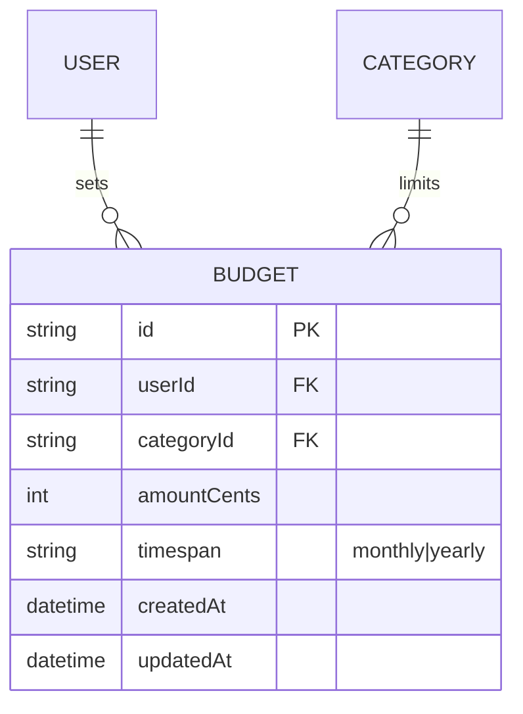

# S4.1 — Budget CRUD

> Story: [Notion S4.1](https://app.notion.com/p/37ca7227e26f81558d20f0f442a8ea4a) · Design: [F4 Budgets](https://app.notion.com/p/37ca7227e26f81a9a97bdcb7ee468f6e) · Design system: [canonical](https://app.notion.com/p/37da7227e26f81f28e85fa5c6d1d38f8) · PR: #10 (base `main`)

## Objective

Add the Budget model and its mutations: category + timespan + amount, with the one-budget-per-(category, timespan) rule. (Budget-vs-actual display + the shared computation are S4.2.)

## Data Model

Adds **Budget**. Amount is `amountCents Int`. Timespan is an enum (`monthly` | `yearly`). Unique compound index `(userId, categoryId, timespan)` enforces the one-per rule at the DB.

`Budget.categoryId` → `onDelete: Restrict` (a category with a budget can't be deleted — extends the F3 guard; this story wires the budget count into `categoryReferenceCount`).

## Approach

1. Prisma: `Budget` model + `@@unique([userId, categoryId, timespan])` + indexes; `prisma migrate dev`; update `docs/architecture/erd.md`.
2. `src/lib/validation/budget.ts` — `budgetSchema` (Zod): `categoryId` non-empty, `timespan` enum, `amount` string→cents (> 0, ≤ $9,999,999.99).
3. `src/app/(dashboard)/budgets/actions.ts` — `createBudget`, `updateBudget`, `deleteBudget`. `requireUser`; category ownership check; **duplicate (category, timespan) → friendly "That category already has a {timespan} budget — edit it instead"** (pre-check + P2002 unique-violation backstop); user-scoped writes; revalidate `/budgets`, `/dashboard`.
4. `src/app/(dashboard)/budgets/page.tsx` (RSC) — list budgets with category, header + Add button; render `<BudgetsClient>`. (Bars/actuals are S4.2; this story shows budget rows with category pill + amount + timespan chip.)
5. `src/components/BudgetsClient.tsx` (client) — create/edit modal (category select, timespan select, amount masked) + rows; delete with inline confirm.
6. Extend `categoryReferenceCount` (S3.2) to add `prisma.budget.count` so deleting a budgeted category is blocked.

## Field rules (Design F4)

| Field | Type | Limits | Validation | Default |
|-------|------|--------|------------|---------|
| Category | FK | belongs to user | required, ownership | — |
| Timespan | enum | monthly · yearly | required | monthly |
| Amount | money (cents) | $0.01–$9,999,999.99 | required, > 0 | — |

## Test Manifest

| ID | Test | Type | Covers |
|----|------|------|--------|
| T1 | `budgetSchema` accepts valid; rejects $0, missing category, bad timespan | unit | AC-1 |
| T2 | create persists amountCents + timespan (user-scoped) | integration (DB) | AC-1 |
| T3 | duplicate (category, timespan) rejected; different timespan same category allowed | integration | AC-2 |
| T4 | update + delete user-scoped; delete never touches expenses | integration | AC-3 |
| T5 | category with a budget can't be deleted (guard extended) | integration | AC-2/F3 |
| T6 | budget modal renders create/edit; duplicate message shows | unit (RTL) | AC-2 |
| T7 | live: create budget, edit it, delete it; duplicate (cat, timespan) blocked | e2e | AC-1/2/3 |

## Results

| ID | Pass/Fail | Evidence |
|----|-----------|----------|

## Deviations

_(none expected)_
