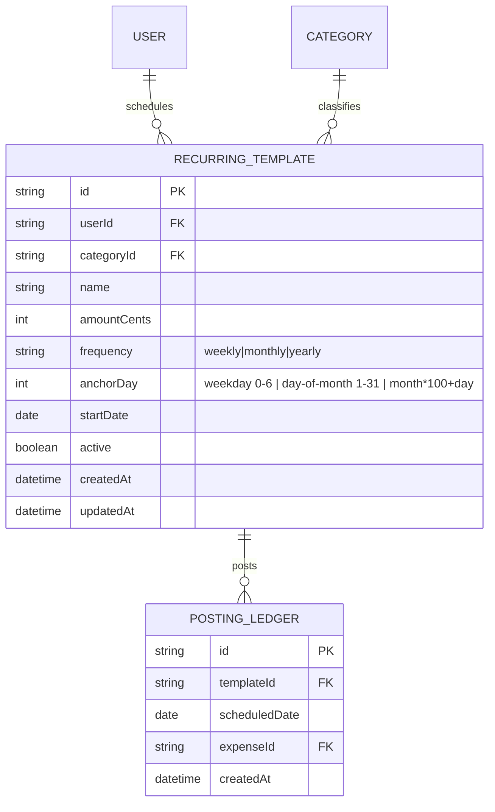

# S6.1 — Recurring template CRUD

> Story: [Notion S6.1](https://app.notion.com/p/37ca7227e26f815fb265d8fa7288adcf) · Design: [F6 Recurring](https://app.notion.com/p/37ca7227e26f810b86b2e9b846dfc861) · Design system: [canonical](https://app.notion.com/p/37da7227e26f81f28e85fa5c6d1d38f8) · PR: #15 (base `main`)

## Objective

Recurring expense templates: model, table, create/edit/pause, and next-date computation with day-of-month clamping. (Generation engine + projection hook = S6.2.)

## Data Model

Adds **RecurringTemplate** and **PostingLedger** (the idempotency table S6.2 writes to; created now so the schema is complete and the ERD lands in one place).

`RecurringTemplate.categoryId` → `onDelete: Restrict` (extends the F3 guard; this story adds recurring to `categoryReferenceCount`). `PostingLedger` has `@@unique([templateId, scheduledDate])` — the idempotency guarantee S6.2 relies on.

## Approach

1. Prisma: `RecurringTemplate` + `PostingLedger` models; migration; update `docs/architecture/erd.md`. Add recurring count to `categoryReferenceCount`.
2. `src/lib/recurrence.ts` — **pure** date helpers (unit-tested):
   - `clampDayToMonth(year, month, day)` → clamps 29–31 to the month's last day (Jan 31 → Feb 28/29);
   - `nextOccurrence(template, after)` → the next scheduled `Date` strictly after `after` (weekly by weekday; monthly by clamped day-of-month; yearly by month+day), never before `startDate`;
   - `monthlyEquivalentCents(template)` → weekly ×52/12, yearly ÷12, monthly ×1 (for the header summary).
3. `src/lib/validation/recurring.ts` — `recurringSchema` (Zod): name 1–120, category, amount cents > 0, frequency enum, anchor (validated per frequency), startDate.
4. `src/app/(dashboard)/recurring/actions.ts` — `createRecurring`, `updateRecurring`, `toggleRecurringActive`, `deleteRecurring`. requireUser, ownership, user-scoped, revalidate.
5. `src/app/(dashboard)/recurring/page.tsx` + `RecurringClient.tsx` — table per Design F6 (name / category pill / amount / frequency / next / active checkbox), create/edit modal, "How it works" explainer panel. Sort by next-date asc; paused sink to bottom at reduced opacity. Active toggle is an immediate server action.

## Field rules (Design F6)

| Field | Type | Limits | Validation | Default |
|-------|------|--------|------------|---------|
| Name | text | 1–120 | required | — |
| Category | FK | ownership | required | — |
| Amount | money (cents) | $0.01–$999,999.99 | required, > 0 | — |
| Frequency | enum | weekly · monthly · yearly | required | monthly |
| Anchor | per frequency | weekday / day 1–31 (clamped) / month+day | required | day 1 |
| Start date | date | any | required | today |
| Active | boolean | — | — | true |

## Test Manifest

| ID | Test | Type | Covers |
|----|------|------|--------|
| T1 | `clampDayToMonth`: 31 → Feb 28 (2026) / Feb 29 (2028 leap); 30 Apr ok | unit | AC-2 |
| T2 | `nextOccurrence`: weekly/monthly/yearly next after a date; respects startDate; clamps | unit | AC-2 |
| T3 | `monthlyEquivalentCents`: weekly ×52/12, yearly ÷12 | unit | AC-4 (summary) |
| T4 | `recurringSchema` valid/invalid | unit | AC-1 |
| T5 | create persists; toggle active; user-scoped update/delete | integration (DB) | AC-1/3 |
| T6 | category with a template can't be deleted (guard extended) | integration | F3 |
| T7 | table sorts next-date asc, paused last; modal renders | unit (RTL) | AC-4 |
| T8 | live: create template, edit, pause toggle, delete | e2e | AC-1/3/4 |

## Results

| ID | Pass/Fail | Evidence |
|----|-----------|----------|
| T1 clampDayToMonth | ✅ Pass | `recurrence.test.ts` — 31→Feb28(2026)/Feb29(2028); Apr 30 ok |
| T2 nextOccurrence weekly/monthly/yearly + startDate + clamp | ✅ Pass | `recurrence.test.ts` |
| T3 monthlyEquivalentCents | ✅ Pass | `recurrence.test.ts` — weekly ×52/12, yearly ÷12 |
| T4 recurringSchema valid/invalid | ✅ Pass | `recurring.test.ts` |
| T5 persist + toggle active + user-scoped | ✅ Pass | `actions.int.test.ts` |
| T6 category-with-template delete blocked | ✅ Pass | `actions.int.test.ts` (guard counts recurring) |
| T7 table sort + modal | ✅ Pass | live: active-first-by-next, paused dimmed at bottom |
| T8 live create + page | ✅ Pass | e2e: 3 templates, summary $961.99/mo, How-it-works; screenshot |

Also: PostingLedger `(templateId, scheduledDate)` uniqueness verified (`actions.int.test.ts`) — the idempotency guarantee S6.2 builds on.

125 tests pass · lint clean · build green · typecheck clean. Live render: `design-assets/docs/design/s6.1-recurring.png`.

## Deviations

- Past-dated start catch-up confirm (Design F6 W1 edge) is enforced in S6.2 (generation) — this story stores the template; generation/cap live with the engine.
